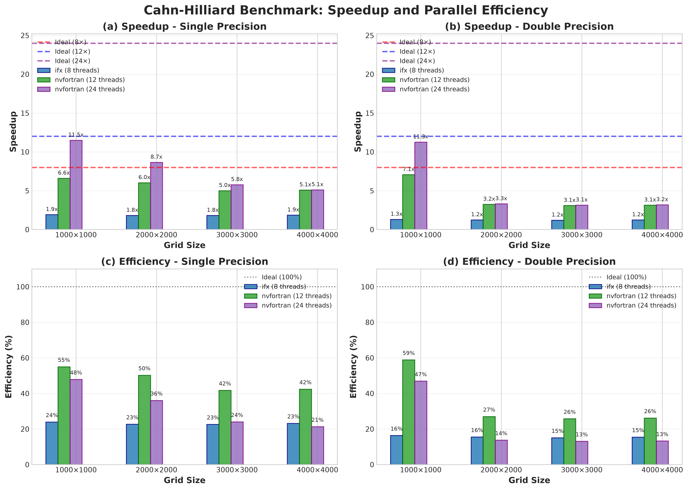

# Compiler-Driven Parallelism in Modern Fortran using `DO CONCURRENT`

> A high-performance 2D Cahn–Hilliard phase-field solver demonstrating compiler-driven parallelism using standard Fortran `DO CONCURRENT`, with performance analysis across Intel oneAPI and NVIDIA HPC SDK compilers.


---



## Overview

This repository investigates compiler-generated parallelism in **Modern Standard Fortran**, evaluates scalability on Intel and NVIDIA compilers, studies SMT behaviour, analyzes memory bandwidth limitations, and quantitatively compares single versus double precision.

It demonstrates how we can develop high-performance scientific applications without relying on compiler-specific parallel programming APIs.

Instead of explicitly writing OpenMP directives or accelerator directives throughout the source code, the solver is implemented using the **Fortran `DO CONCURRENT` construct**, allowing the compiler to generate parallel code automatically while preserving a clean and portable programming model.

The project uses a two-dimensional **Cahn–Hilliard phase-field solver** as a realistic scientific computing benchmark. This type of stencil-based partial differential equation is representative of applications encountered in computational materials science, fluid dynamics, and multiphysics simulations.

---

## Project Objectives

The primary goals of this repository are to demonstrate

* Modern Fortran software engineering practices
* Compiler-driven parallel programming using `DO CONCURRENT`
* Portable performance across multiple HPC compilers
* High-performance implementation of stencil-based PDE solvers
* Performance evaluation using compiler optimization reports and benchmarking

---

## Key Features

* Modern Fortran (2018)
* Standard `DO CONCURRENT` parallelism
* Compiler-driven multithreading
* Intel oneAPI ifx support
* NVIDIA HPC SDK support
* Configurable single and double precision
* Modular object-oriented design
* CMake build system
* Compiler optimization reports
* Performance benchmarking using MLUPS
* Cross-platform support (Windows and Linux)

---

## Numerical Model

The solver implements a two-dimensional Cahn–Hilliard equation using finite differences on a structured Cartesian grid.

Implemented components include

* Structured grid generation
* Random microstructure initialization
* Free-energy evaluation
* Laplacian operators
* Explicit time integration
* Periodic boundary conditions
* Performance measurement utilities

---

## Software Architecture

```
app/
    main_driver.f90

src/
    precisions_control.f90
    core_utilities.f90
    grid_setup.f90
    grid_generator.f90
    microstructure_initializer.f90
    phase_field_core.f90
    free_energy_kernel.f90
    laplacian_kernel.f90
    time_kernel.f90
    io_handlers.f90
    performance_timer.f90
    performance_analyzer.f90
    performance_evaluation.f90
    simulation_config.f90
    error_handler.f90
```

The project follows a modular architecture where numerical kernels, utilities, timing routines, and solver infrastructure are implemented as independent modules.

---





---

## Parallel Programming Model

Unlike traditional HPC implementations that explicitly annotate loops with compiler directives, this solver relies exclusively on the standard Fortran

```fortran
do concurrent (...)
```

construct.

Compiler-specific backends automatically generate the appropriate parallel implementation.

| Compiler         | Parallel Backend                           |
| ---------------- | ------------------------------------------ |
| Intel oneAPI ifx | OpenMP runtime                             |
| NVIDIA HPC SDK   | Standard Parallelism (`-stdpar=multicore`) |

No OpenMP directives are required inside the numerical kernels.

---

## Precision Support

The solver supports both

* Single precision
* Double precision

The precision is selected at compile time through CMake without modifying the source code.

---

## Build

### Intel oneAPI ifx

```bash
cmake -DCMAKE_Fortran_COMPILER=ifx ..
cmake --build .
```

### NVIDIA HPC SDK

```bash
cmake -DCMAKE_Fortran_COMPILER=nvfortran ..
make
```

---

## Performance Evaluation

Performance is reported using

* Execution time
* MLUPS (Million Lattice Updates Per Second)
* Compiler optimization reports
* Parallel scaling
* Single vs. double precision comparisons

Benchmark studies include

* Multiple grid sizes
* Multiple thread counts
* Intel oneAPI ifx
* NVIDIA HPC SDK

---

## Results

Performance analysis demonstrates

* Efficient compiler-generated multithreading
* Automatic SIMD vectorization
* Excellent scaling on multicore processors
* Expected memory-bandwidth limitations for large stencil computations
* Portable performance across different compiler ecosystems

Compiler optimization reports confirm that `DO CONCURRENT` loops are automatically transformed into parallel loops and vectorized without requiring compiler directives in the source code.

---

## Why This Repository?

Many examples of scientific Fortran focus primarily on numerical algorithms.

This project instead emphasizes the complete workflow of modern HPC software development, including

* Software architecture
* Modern language features
* Build system design
* Compiler portability
* Performance engineering
* Benchmark methodology
* Optimization analysis

The repository is intended as both a learning resource and a reference implementation for compiler-driven parallel scientific computing.

---

## Technical Documentation

A comprehensive technical document accompanies this repository and provides

* Mathematical formulation
* Numerical discretization
* Software architecture
* Module-by-module implementation
* Compiler configuration
* Parallel programming strategy
* Benchmark methodology
* Optimization reports
* Performance analysis
* Discussion of scalability and memory-bandwidth limitations

## Benchmark Configuration

Compiler
- Intel oneAPI ifx 2026.0
- NVIDIA HPC SDK 24.5

Hardware
- AMD Ryzen 9 3900XT
- 12 cores / 24 threads

Operating Systems
- Windows 11
- Ubuntu (WSL)

Build Type
- Release

---

### v1.1.0 (Planned)

Performance improvements

- Memory layout optimization
- Improved cache locality
- Faster Laplacian kernel
- Updated benchmark results

## License

MIT License

---

## Author

**Shahid Maqbool**

Research interests include

* High Performance Computing (HPC)
* Scientific Computing
* Computational Materials Science
* Modern Fortran
* Compiler Technology
* Parallel Programming
* Machine Learning
